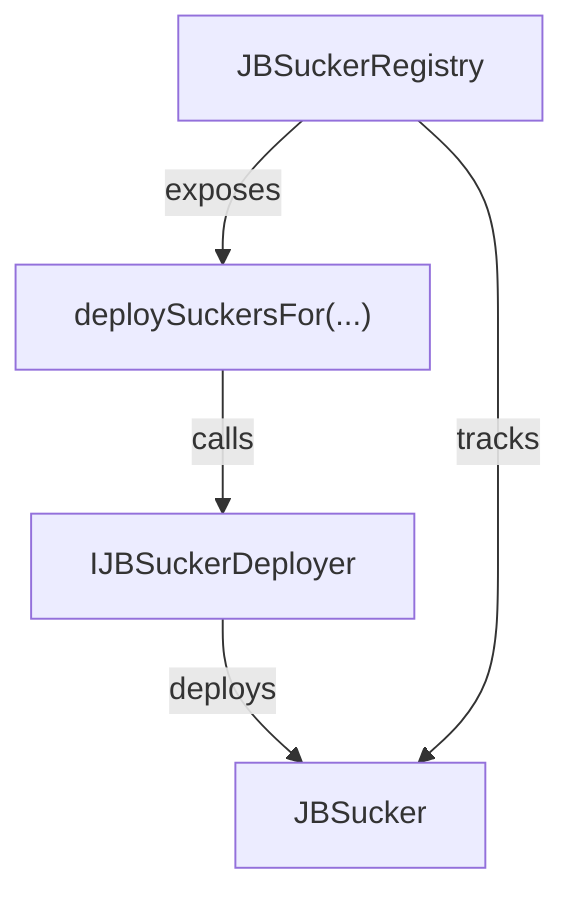
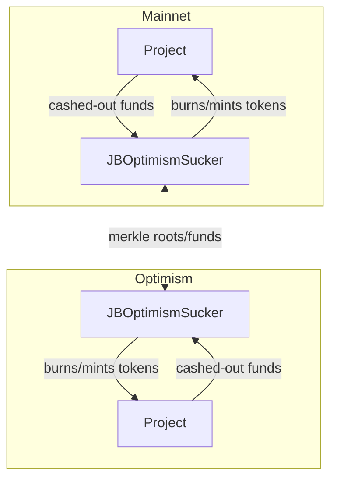

# nana-suckers-v6

Cross-chain bridging for Juicebox V6 projects. Suckers let users burn project tokens on one chain and receive the same amount on another, moving the backing funds across via merkle-tree-based claims and chain-specific bridges.

<details>
  <summary>Table of Contents</summary>
  <ol>
    <li><a href="#what-are-suckers">What are Suckers?</a></li>
    <li><a href="#architecture">Architecture</a></li>
    <li><a href="#bridging-flow">Bridging Flow</a></li>
    <li><a href="#bridging-tokens">Bridging Tokens</a></li>
    <li><a href="#launching-suckers">Launching Suckers</a></li>
    <li><a href="#managing-suckers">Managing Suckers</a></li>
    <li><a href="#using-the-relayer">Using the Relayer</a></li>
    <li><a href="#resources">Resources</a></li>
    <li><a href="#repository-layout">Repository Layout</a></li>
    <li><a href="#usage">Usage</a></li>
    <ul>
      <li><a href="#install">Install</a></li>
      <li><a href="#develop">Develop</a></li>
      <li><a href="#scripts">Scripts</a></li>
      <li><a href="#tips">Tips</a></li>
    </ul>
  </ol>
</details>

_If you're having trouble understanding this contract, take a look at the [core protocol contracts](https://github.com/Bananapus/nana-core-v6) and the [documentation](https://docs.juicebox.money/) first. If you have questions, reach out on [Discord](https://discord.com/invite/ErQYmth4dS)._

## What are Suckers?

`JBSucker` contracts are deployed in pairs, with one on each network being bridged to or from. The [`JBSucker`](src/JBSucker.sol) contract implements core logic, and is extended by network-specific implementations adapted to each bridge:

| Sucker | Networks | Description |
|--------|----------|-------------|
| [`JBCCIPSucker`](src/JBCCIPSucker.sol) | Any CCIP-connected chains | Uses [Chainlink CCIP](https://docs.chain.link/ccip) (`ccipSend`/`ccipReceive`). Handles native token wrapping/unwrapping for chains with different native assets. |
| [`JBOptimismSucker`](src/JBOptimismSucker.sol) | Ethereum and Optimism | Uses the [OP Standard Bridge](https://docs.optimism.io/builders/app-developers/bridging/standard-bridge) and the [OP Messenger](https://docs.optimism.io/builders/app-developers/bridging/messaging). |
| [`JBBaseSucker`](src/JBBaseSucker.sol) | Ethereum and Base | A thin wrapper around `JBOptimismSucker` with Base chain IDs. |
| [`JBArbitrumSucker`](src/JBArbitrumSucker.sol) | Ethereum and Arbitrum | Uses the [Arbitrum Inbox](https://docs.arbitrum.io/build-decentralized-apps/cross-chain-messaging) and the [Arbitrum Gateway](https://docs.arbitrum.io/build-decentralized-apps/token-bridging/bridge-tokens-programmatically/get-started). Handles L1<->L2 retryable tickets. |

Suckers use two [merkle trees](https://en.wikipedia.org/wiki/Merkle_tree) to track project token claims associated with each terminal token they support:

- The **outbox tree** tracks tokens on the local chain — the network that the sucker is on.
- The **inbox tree** tracks tokens which have been bridged from the peer chain — the network that the sucker's peer is on.

For example, a sucker which supports bridging ETH and USDC would have four trees — an inbox and outbox tree for each token. These trees are append-only, and when they're bridged over to the other chain, they aren't deleted — they only update the remote inbox tree with the latest root.

To insert project tokens into the outbox tree, users call `JBSucker.prepare(...)` with the amount of project tokens to bridge and the terminal token to bridge with them. The sucker cashes out those project tokens to reclaim the chosen terminal token from the project's primary terminal. Then it inserts a claim with this information into the outbox tree.

Anyone can bridge an outbox tree to the peer chain by calling `JBSucker.toRemote(token)`. The outbox tree then _becomes_ the peer sucker's inbox tree for that token. Users can claim their tokens on the peer chain by providing a merkle proof which shows that their claim is in the inbox tree.

## Architecture

On each network:



For an example project deployed on mainnet and Optimism with a `JBOptimismSucker` on each network:



### Contracts

| Contract | Description |
|----------|-------------|
| `JBSucker` | Abstract base. Manages outbox/inbox merkle trees, `prepare`/`toRemote`/`claim` lifecycle, token mapping, deprecation, and emergency hatch. Deployed as clones via `Initializable`. |
| `JBCCIPSucker` | Extends `JBSucker`. Bridges via Chainlink CCIP (`ccipSend`/`ccipReceive`). Supports any CCIP-connected chain. Handles native token wrapping/unwrapping. |
| `JBOptimismSucker` | Extends `JBSucker`. Bridges via OP Standard Bridge + OP Messenger. |
| `JBBaseSucker` | Thin wrapper around `JBOptimismSucker` with Base chain IDs. |
| `JBArbitrumSucker` | Extends `JBSucker`. Bridges via Arbitrum Inbox + Gateway Router. Handles L1<->L2 retryable tickets. |
| `JBSuckerRegistry` | Tracks all suckers per project. Manages deployer allowlist. Entry point for `deploySuckersFor`. |
| `JBSuckerDeployer` | Abstract base deployer. Clones a singleton sucker via `LibClone.cloneDeterministic` and initializes it. |
| `JBCCIPSuckerDeployer` | Deployer for `JBCCIPSucker`. Stores CCIP router, remote chain ID, and chain selector. |
| `JBOptimismSuckerDeployer` | Deployer for `JBOptimismSucker`. Stores OP Messenger and OP Bridge addresses. |
| `JBBaseSuckerDeployer` | Thin wrapper around `JBOptimismSuckerDeployer` for Base. |
| `JBArbitrumSuckerDeployer` | Deployer for `JBArbitrumSucker`. Stores Arbitrum Inbox, Gateway Router, and layer (L1/L2). |
| `MerkleLib` | Incremental merkle tree (depth 32, modeled on eth2 deposit contract). Used for outbox/inbox trees. |
| `CCIPHelper` | CCIP router addresses, chain selectors, and WETH addresses per chain. |
| `ARBAddresses` | Arbitrum bridge contract addresses (Inbox, Gateway Router) for mainnet and Sepolia. |
| `ARBChains` | Arbitrum chain ID constants. |

## Bridging Flow

```
Chain A                              Chain B
  |                                    |
  |  1. prepare(tokenCount, ...)       |
  |     - transfers project tokens     |
  |     - cashes out for terminal tkn  |
  |     - inserts leaf into outbox     |
  |                                    |
  |  2. toRemote(token)                |
  |     - sends merkle root + funds -->|
  |                                    |
  |                          3. fromRemote(root)
  |                             - updates inbox tree
  |                                    |
  |                          4. claim(proof)
  |                             - verifies merkle proof
  |                             - mints project tokens
  |                             - adds funds to balance
```

## Bridging Tokens

Imagine that "OhioDAO" is deployed on Ethereum mainnet and Optimism:

- It has the $OHIO ERC-20 project token and a `JBOptimismSucker` deployed on each network.
- Its suckers map mainnet ETH to Optimism ETH, and vice versa.

Each sucker has mappings from terminal tokens on the local chain to associated terminal tokens on the remote chain.

_Here's how Jimmy can bridge his $OHIO tokens (and the corresponding ETH) from mainnet to Optimism._

**1. Pay the project.** Jimmy pays OhioDAO 1 ETH on Ethereum mainnet:

```solidity
JBMultiTerminal.pay{value: 1 ether}({
    projectId: 12,
    token: JBConstants.NATIVE_TOKEN,
    amount: 1 ether,
    beneficiary: jimmy,
    minReturnedTokens: 0,
    memo: "OhioDAO rules",
    metadata: ""
});
```

OhioDAO's ruleset has a `weight` of `1e18`, so Jimmy receives 1 $OHIO (`1e18` tokens).

**2. Approve the sucker.** Before bridging, Jimmy approves the `JBOptimismSucker` to transfer his $OHIO:

```solidity
JBERC20.approve({
    spender: address(optimismSucker),
    value: 1e18
});
```

**3. Prepare the bridge.** Jimmy calls `prepare(...)` on the mainnet sucker:

```solidity
JBOptimismSucker.prepare({
    projectTokenAmount: 1e18,
    beneficiary: jimmy,
    minTokensReclaimed: 0,
    token: JBConstants.NATIVE_TOKEN
});
```

The sucker transfers Jimmy's $OHIO to itself, cashes them out using OhioDAO's primary ETH terminal, and inserts a leaf into the ETH outbox tree. The leaf is a `keccak256` hash of the beneficiary's address, the project token count, and the terminal token amount reclaimed.

**4. Bridge to remote.** Jimmy (or anyone) calls `toRemote(...)`:

```solidity
JBOptimismSucker.toRemote(JBConstants.NATIVE_TOKEN);
```

This sends the outbox merkle root and the accumulated ETH to the peer sucker on Optimism. After the bridge completes, the Optimism sucker's ETH inbox tree is updated with the new root containing Jimmy's claim.

**5. Claim on the remote chain.** Jimmy claims his $OHIO on Optimism by calling `claim(...)` with a [`JBClaim`](src/structs/JBClaim.sol):

```solidity
struct JBClaim {
    address token;
    JBLeaf leaf;
    bytes32[32] proof; // Must be TREE_DEPTH (32) long.
}
```

The [`JBLeaf`](src/structs/JBLeaf.sol):

```solidity
struct JBLeaf {
    uint256 index;
    address beneficiary;
    uint256 projectTokenCount;
    uint256 terminalTokenAmount;
}
```

Building these claims manually requires tracking every insertion and computing merkle proofs. The [`juicerkle`](https://github.com/Bananapus/juicerkle) service simplifies this — `POST` a JSON request to `/claims`:

```json
{
    "chainId": 10,
    "sucker": "0x5678...",
    "token": "0x000000000000000000000000000000000000EEEe",
    "beneficiary": "0x1234..."
}
```

| Field | Type | Description |
|-------|------|-------------|
| `chainId` | `int` | Network ID for the sucker being claimed from. |
| `sucker` | `string` | Address of the sucker being claimed from. |
| `token` | `string` | Terminal token whose inbox tree is being claimed from. |
| `beneficiary` | `string` | Address to get available claims for. |

The service looks through the entire inbox tree and returns all available claims as `JBClaim` structs ready to pass to `claim(...)`.

If the sucker's `ADD_TO_BALANCE_MODE` is `ON_CLAIM`, the bridged ETH is immediately added to OhioDAO's Optimism balance. Otherwise, someone calls `addOutstandingAmountToBalance(token)` to add it manually.

## Launching Suckers

Requirements for deploying a sucker pair:

1. **Projects on both chains.** Project IDs don't have to match.
2. **100% cash out rate.** Both projects must have `cashOutTaxRate` of `JBConstants.MAX_CASH_OUT_TAX_RATE` so suckers can fully cash out project tokens for terminal tokens.
3. **Owner minting enabled.** Both projects must have `allowOwnerMinting` set to `true` so suckers can mint bridged project tokens.
4. **ERC-20 project token.** Both projects must have a deployed ERC-20 token (via `JBController.deployERC20For(...)`).

Suckers are deployed through the [`JBSuckerRegistry`](src/JBSuckerRegistry.sol) on each chain. The registry maps local tokens to remote tokens during deployment, so it needs permission:

```solidity
// Give the registry MAP_SUCKER_TOKEN permission for project 12
uint256[] memory permissionIds = new uint256[](1);
permissionIds[0] = JBPermissionIds.MAP_SUCKER_TOKEN; // ID 28

permissions.setPermissionsFor(
    projectOwner,
    JBPermissionsData({
        operator: address(registry),
        projectId: 12,
        permissionIds: permissionIds
    })
);
```

Now deploy the suckers with a token mapping:

```solidity
// Map mainnet ETH to Optimism ETH
JBTokenMapping[] memory mappings = new JBTokenMapping[](1);
mappings[0] = JBTokenMapping({
    localToken: JBConstants.NATIVE_TOKEN,
    minGas: 200_000,
    remoteToken: JBConstants.NATIVE_TOKEN,
    minBridgeAmount: 0.025 ether
});

JBSuckerDeployerConfig[] memory configs = new JBSuckerDeployerConfig[](1);
configs[0] = JBSuckerDeployerConfig({
    deployer: IJBSuckerDeployer(optimismSuckerDeployer),
    mappings: mappings
});

// Must use the same salt and caller on both chains
bytes32 salt = keccak256("my-project-suckers-v1");
address[] memory suckers = registry.deploySuckersFor(12, salt, configs);
```

- The [`JBTokenMapping`](src/structs/JBTokenMapping.sol) maps local mainnet ETH to remote Optimism ETH.
  - `minBridgeAmount` prevents spam — ours blocks attempts to bridge less than 0.025 ETH.
  - `minGas` requires a gas limit of at least 200,000. If your token has expensive transfer logic, you may need more.
- The [`JBSuckerDeployerConfig`](src/structs/JBSuckerDeployerConfig.sol) specifies which deployer to use. You can only use approved deployers through the registry — check for `SuckerDeployerAllowed` events or contact the registry's owner.
- **For the suckers to be peers, the `salt` has to match on both chains and the same address must call `deploySuckersFor(...)`.**

Finally, give the sucker permission to mint bridged project tokens:

```solidity
uint256[] memory mintPermissionIds = new uint256[](1);
mintPermissionIds[0] = JBPermissionIds.MINT_TOKENS; // ID 9

permissions.setPermissionsFor(
    projectOwner,
    JBPermissionsData({
        operator: suckers[0],
        projectId: 12,
        permissionIds: mintPermissionIds
    })
);
```

Repeat this process on the other chain to deploy the peer sucker, and the project is ready for bridging.

## Managing Suckers

Once configured, suckers manage themselves. Stay up-to-date on changes to the bridge infrastructure used by your sucker of choice. If a change causes suckers to become incompatible with the underlying bridge, there are two options.

**Always perform these actions on BOTH sides of the sucker pair.**

### Disable a token

If a bridge change affects only certain tokens, call `mapToken(...)` with `remoteToken` set to `address(0)` to disable that token. If the bridge won't allow a final transfer with the remaining funds, activate the `EmergencyHatch` for the affected tokens.

The emergency hatch lets depositors withdraw their funds on the chain where they deposited. Only those whose funds have not been sent to the remote chain can withdraw. Once opened for a token, that token can never be bridged by this sucker again — deploy a new sucker instead.

### Deprecate the suckers

If the bridging infrastructure will no longer work, deprecate the sucker to begin shutdown. The deprecation timestamp must be at least `_maxMessagingDelay()` (14 days) in the future to ensure no funds or roots are lost in transit. After this duration, all tokens allow exit through the `EmergencyHatch` and no new messages are accepted. This protects against future fake or malicious bridge messages.

When deprecating, ensure no pending bridge messages need retrying — once deprecation completes, those messages will be rejected.

## Using the Relayer

Bridging from L1 to L2 is straightforward. Bridging from L2 to L1 requires extra steps to finalize the withdrawal. For OP Stack networks like Optimism or Base, this follows the [withdrawal flow](https://docs.optimism.io/stack/protocol/withdrawal-flow):

1. The **withdrawal initiating transaction**, which the user submits on L2.
2. The **withdrawal proving transaction**, which the user submits on L1 to prove that the withdrawal is legitimate (based on a merkle patricia trie root).
3. The **withdrawal finalizing transaction**, which the user submits on L1 after the fault challenge period has passed.

Users can do this manually, but it's a hassle. The [`bananapus-sucker-relayer`](https://github.com/Bananapus/bananapus-sucker-relayer) automates proving and finalizing withdrawals using [OpenZeppelin Defender](https://www.openzeppelin.com/defender). Project creators set up a Defender account, configure a relayer through their dashboard, and fund it with ETH for gas.

## Resources

- [`MerkleLib`](src/utils/MerkleLib.sol) — Incremental merkle tree based on [Nomad's implementation](https://github.com/nomad-xyz/nomad-monorepo/blob/main/solidity/nomad-core/libs/Merkle.sol) and the eth2 deposit contract.
- [`juicerkle`](https://github.com/Bananapus/juicerkle) — Service that returns available claims for a beneficiary (generates merkle proofs). Includes a [Go merkle tree implementation](https://github.com/Bananapus/juicerkle/blob/master/tree/tree.go) for computing roots and building/verifying proofs.
- [`juicerkle-tester`](https://github.com/Bananapus/juicerkle-tester) — End-to-end bridging test: deploys projects, tokens, and suckers, then bridges between them. Useful as a bridging walkthrough.

## Repository Layout

```
nana-suckers-v6/
├── script/
│   ├── Deploy.s.sol - Deployment script.
│   └── helpers/
│       └── SuckerDeploymentLib.sol - Internal helpers for deployment.
├── src/
│   ├── JBSucker.sol - Abstract base sucker implementation.
│   ├── JBCCIPSucker.sol - Chainlink CCIP bridge implementation.
│   ├── JBOptimismSucker.sol - OP Stack bridge implementation.
│   ├── JBBaseSucker.sol - Base-specific wrapper around JBOptimismSucker.
│   ├── JBArbitrumSucker.sol - Arbitrum bridge implementation.
│   ├── JBSuckerRegistry.sol - Registry tracking suckers per project.
│   ├── deployers/ - Deployers for each kind of sucker.
│   ├── enums/ - JBAddToBalanceMode, JBLayer, JBSuckerState.
│   ├── interfaces/ - Contract interfaces.
│   ├── libraries/ - ARBAddresses, ARBChains, CCIPHelper.
│   ├── structs/ - JBClaim, JBLeaf, JBMessageRoot, JBOutboxTree, etc.
│   └── utils/
│       └── MerkleLib.sol - Incremental merkle tree (depth 32).
└── test/
    ├── Fork.t.sol - Fork tests.
    ├── SuckerAttacks.t.sol - Security-focused attack tests.
    ├── SuckerDeepAttacks.t.sol - Deep attack scenario tests.
    ├── mocks/ - Mock contracts for testing.
    └── unit/ - Unit tests (merkle, registry, deployer, emergency, arb).
```

## Usage

### Install

For projects using `npm` to manage dependencies (recommended):

```bash
npm install @bananapus/suckers-v6
```

For projects using `forge` to manage dependencies:

```bash
forge install Bananapus/nana-suckers-v6
```

If you're using `forge`, add `@bananapus/suckers-v6/=lib/nana-suckers-v6/` to `remappings.txt`. You'll also need to install `nana-suckers-v6`'s dependencies and add similar remappings for them.

### Develop

`nana-suckers-v6` uses [npm](https://www.npmjs.com/) (version >=20.0.0) for package management and the [Foundry](https://github.com/foundry-rs/foundry) development toolchain for builds, tests, and deployments. To get set up, [install Node.js](https://nodejs.org/en/download) and install [Foundry](https://github.com/foundry-rs/foundry):

```bash
curl -L https://foundry.paradigm.xyz | sh
```

Download and install dependencies with:

```bash
npm ci && forge install
```

If you run into trouble with `forge install`, try using `git submodule update --init --recursive` to ensure that nested submodules have been properly initialized.

| Command | Description |
|---------|-------------|
| `forge build` | Compile the contracts and write artifacts to `out`. |
| `forge test` | Run the tests. |
| `forge test -vvvv` | Run tests with full traces. |
| `forge fmt` | Lint. |
| `forge coverage` | Generate a test coverage report. |
| `forge build --sizes` | Get contract sizes. |
| `forge clean` | Remove build artifacts and cache. |
| `foundryup` | Update Foundry. Run this periodically. |

To learn more, visit the [Foundry Book](https://book.getfoundry.sh/) docs.

### Scripts

| Command | Description |
|---------|-------------|
| `npm test` | Run local tests. |
| `npm run coverage` | Generate an LCOV test coverage report. |
| `npm run artifacts` | Fetch Sphinx artifacts and write them to `deployments/`. |

### Tips

To view test coverage, run `npm run coverage` to generate an LCOV test report. You can use an extension like [Coverage Gutters](https://marketplace.visualstudio.com/items?itemName=ryanluker.vscode-coverage-gutters) to view coverage in your editor.

If you're using Nomic Foundation's [Solidity](https://marketplace.visualstudio.com/items?itemName=NomicFoundation.hardhat-solidity) extension in VSCode, you may run into LSP errors because the extension cannot find dependencies outside of `lib`. You can often fix this by running:

```bash
forge remappings >> remappings.txt
```

This makes the extension aware of default remappings.
